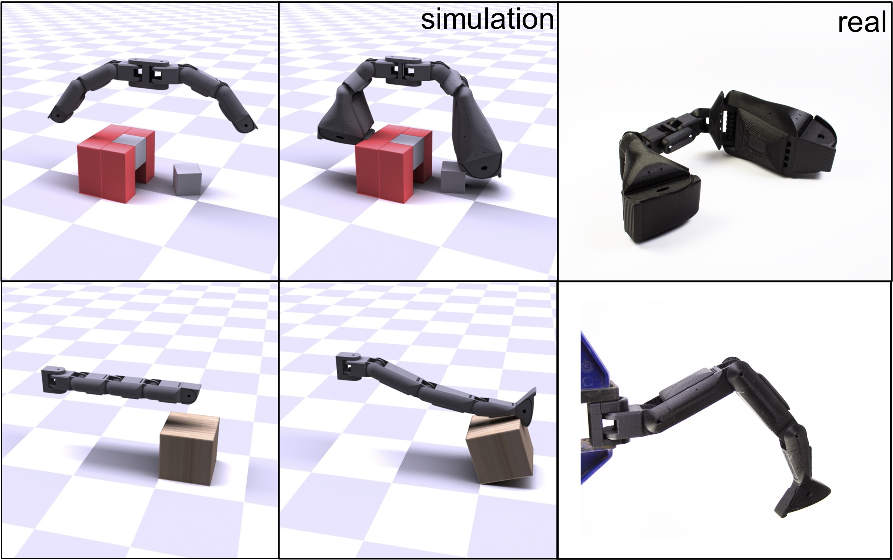
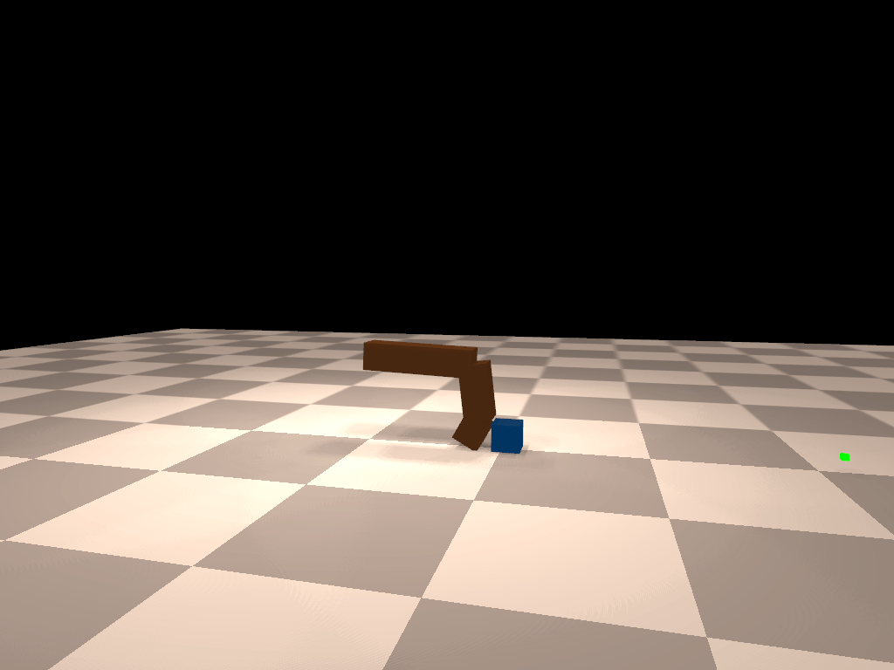

# DiffHand

This repository contains the implementation for the paper [An End-to-End Differentiable Framework for Contact-Aware Robot Design](http://diffhand.csail.mit.edu/) (**RSS 2021**). 

In this paper, we propose a fully differentiable pipeline to jointly optimize the morphology and control of manipulator robots. At the core of the framework is a deformation-based morphology parameterization and a differentiable simulation.  

The framework itself is general and not limited to manipulator robots, we select the case study of manipulator robots because of its complexity and contact-rich nature. Welcome to try our code on any other types robots as well.

<p align="center">
    
</p>


## Installation

**Operating System**: tested on Ubuntu 16.04 and Ubuntu 18.04

1. Clone the project from github: `git clone https://github.com/eanswer/DiffHand.git --recursive `.

2. Install **CMake** >= 3.1.0: [official instruction for cmake installation](https://cmake.org/install/)

3. build conda environment and install simulation

   ```
   cd DiffHand
   conda env create -f environment.yml
   cd core
   python setup.py install
   ```

4. Test the installation

   ```
   cd examples
   python test_redmax.py
   ```

   If you see a simulation rendering with a two-link pendulum as below, you have successfully installed the code base.

   <p align="center">
       
   </p>


## Code Structure

There are two main components of the code base:

- **Differentiable RedMax**: `DiffHand/core`. The differentiable redmax is based off [RedMax](https://people.engr.tamu.edu/sueda/projects/redmax/index.html) and further makes if fully differentiable. It provides the simulation derivatives w.r.t. both simulation parameters (kinematics- and dynamics-related parameter) and control actions. It is implemented in C++ for computing efficiency. We provide a [simulation document](https://people.csail.mit.edu/jiex/papers/DiffHand/redmax_doc.pdf) for mathematical details of our differentiable RedMax.
- **Morphology and Control Co-Optimization**: `DiffHand/examples`. We build an end-to-end differentiable framework to co-optimize both the morphology and control of manipulators. We use L-BFGS-B as our default gradient-based optimizer and also provides the source code for the gradient-free baseline methods.


## Run the Code

It is recommended to try out the scripts in **play with redmax simulation** first if you would like to get familiar with simulation interface.

#### Run the examples in the paper

We include the four co-design tasks from the paper in the `examples` folder. 

- **Finger Reach**
- **Rotate Cube**
- **Flip Box**
- **Assemble**

To run the `L-BFGS-B` optimization with our deformation-based design parameterization, you can enter the corresponding folder and run `demo.sh` under the folder. For example, to run **Finger Reach**,

```
cd examples/rss_finger_reach
bash demo.sh
```


#### Run batch experiments of baseline algorithms

We include the gradient-free baselines (except RL) and the control-only baseline in this repository. For the RL baseline, we use the [released code](https://github.com/ksluck/Coadaptation) from Luck et al with some modifications to our proposed morphology parameterization.

To run the baseline algorithms or our method in a batch mode, enter the corresponding folder and run `run_batch_experiments.py`. For example, to run **Flip Cube** with *CMA-ES*,

```
cd examples/rss_finger_flip
python run_batch_experiments.py --method CMA --num-seeds 5 --num-processes 5 --save-dir ./results/
```


#### Play with redmax simulation

We provide several examples to test the forward simulation and its differentiability. 

- `examples/test_redmax.py` provides the script to show how to run forward simulation and rendering. It can be easily executed by:

  ```
  python test_redmax.py --model hand_sphere
  ```

  Here, you can also try other models provided in `assets` folder (models are described by `xml` configuration files).

- `examples/test_finger_flick_optimize.py` provides an example for using the backward gradients of the simulation. In this example, we use gradient-based optimization to optimize the control sequence of a pendulum finger model to flick a cube to a target location. run it by:

  ```
  python test_finger_flick_optimzie.py
  ```

  The initial control sequence is shown first and you can press [Esc] to close the rendering and start the optimization. After successful optimization, you will see a rendering as below:

  <p align="center">
      </p>


## Citation

If you find our paper or code is useful, please consider citing: 

```
@INPROCEEDINGS{Xu-RSS-21, 
    AUTHOR    = {Jie Xu AND Tao Chen AND Lara Zlokapa AND Michael Foshey AND Wojciech Matusik AND Shinjiro Sueda AND Pulkit Agrawal}, 
    TITLE     = {{An End-to-End Differentiable Framework for Contact-Aware Robot Design}}, 
    BOOKTITLE = {Proceedings of Robotics: Science and Systems}, 
    YEAR      = {2021}, 
    ADDRESS   = {Virtual}, 
    MONTH     = {July}, 
    DOI       = {10.15607/RSS.2021.XVII.008} 
} 
```