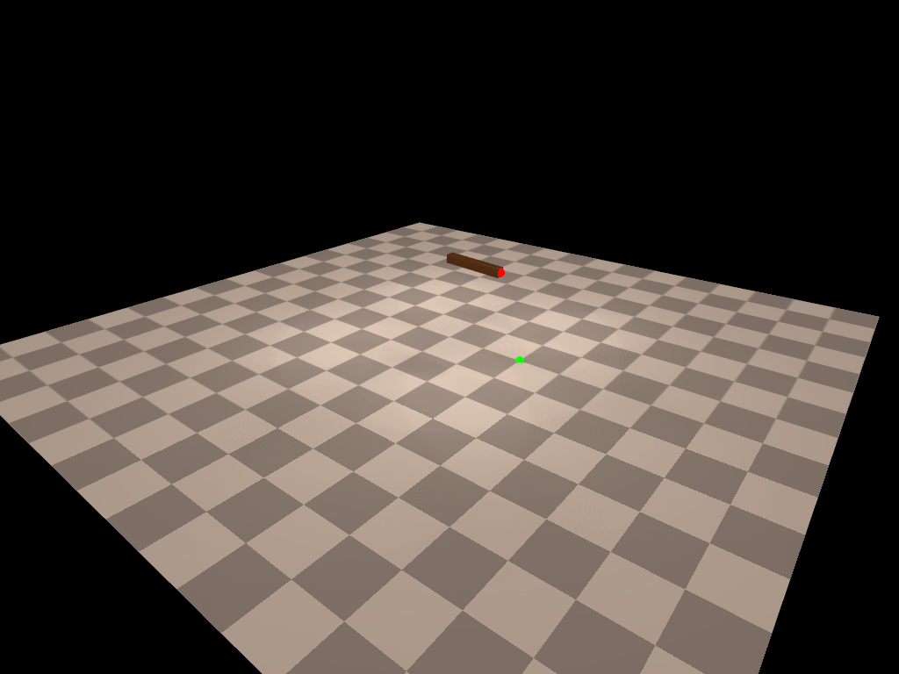

## Docker setup

Install Docker and nvidia-docker-runtime. 

```bash
# install docker
sudo apt-get remove docker docker-engine docker.io containerd runc
sudo apt-get update
sudo apt-get install \
    apt-transport-https \
    ca-certificates \
    curl \
    gnupg-agent \
    software-properties-common
curl -fsSL https://download.docker.com/linux/ubuntu/gpg | sudo apt-key add -
sudo add-apt-repository \
   "deb [arch=amd64] https://download.docker.com/linux/ubuntu \
   $(lsb_release -cs) \
   stable"
sudo apt-get update
sudo apt-get install docker-ce docker-ce-cli containerd.io
```

```bash
# install nvidia-docker-runtime
curl -s -L https://nvidia.github.io/nvidia-container-runtime/gpgkey | \
  sudo apt-key add -
distribution=$(. /etc/os-release;echo $ID$VERSION_ID)
curl -s -L https://nvidia.github.io/nvidia-container-runtime/$distribution/nvidia-container-runtime.list | \
  sudo tee /etc/apt/sources.list.d/nvidia-container-runtime.list
sudo apt-get update
sudo apt-get install nvidia-container-runtime

sudo mkdir -p /etc/systemd/system/docker.service.d
sudo tee /etc/systemd/system/docker.service.d/override.conf <<EOF
[Service]
ExecStart=
ExecStart=/usr/bin/dockerd --host=fd:// --add-runtime=nvidia=/usr/bin/nvidia-container-runtime
EOF
sudo systemctl daemon-reload
sudo systemctl restart docker
```

Enable root permission to the user so that we can run docker without sudo:
```bash
sudo groupadd docker
sudo usermod -aG docker $USER
newgrp docker
```
## Build docker image

```bash
python docker_build.py
```

## Run docker image

Launch docker:

```bash
docker run -it --gpus all -e NVIDIA_DRIVER_CAPABILITIES=all -e NVIDIA_VISIBLE_DEVICES=all --net=host --env="DISPLAY" diffhand:latest
```

To enable GUI visualization, run the following command in a new terminal (you only need to run this once):

```
sudo ./visualize_access.sh
```

Run test example:

```
cd DiffHand/examples
python test_redmax.py
```

If you see a simulation rendering with a two-link pendulum as below, you have successfully installed the code base.

<p align="center">
    
</p>

